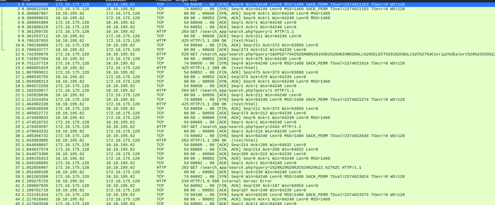

<html>
  <head>
    <link rel="icon" href="/assets/imgs/beans.png" type="image/png">
  </head>
  
</html>

[Main Page](/index)

# Sequel Dump

---

Today I’d like to share a challenge from TryHackMe’s student CTF event, Hackfinity Battle. The challenge was labeled as `Hard` and was worth 90 points. Let’s take a look!

So the challenge provided a `.pcapng` file so let’s take a look at it in wireshark.



And as we can see in the bottom right


We have quite a bit to look at. The first thing that caught my attention were the long http requests. Let’s take a look at one of them:

```php
GET /search_app/search.php?query=1&XPGZ=7942%20AND%201%3D1%20UNION%20ALL%20SELECT%201%2CNULL%2C%27%3Cscript%3Ealert%28%22XSS%22%29%3C%2Fscript%3E%27%2Ctable_name%20FROM%20information_schema.tables%20WHERE%202%3E1--%2F%2A%2A%2F%3B%20EXEC%20xp_cmdshell%28%27cat%20..%2F..%2F..%2Fetc%2Fpasswd%27%29%23 HTTP/1.1
```

We can click on the packet and copy the http request in UTF-8. We can use [CyberChef](https://gchq.github.io/CyberChef/) to url decode it:

```php
GET /search_app/search.php?query=1&XPGZ=7942 AND 1=1 UNION ALL SELECT 1,NULL,'<script>alert("XSS")</script>',table_name FROM information_schema.tables WHERE 2>1--/**/; EXEC xp_cmdshell('cat ../../../etc/passwd')# HTTP/1.1
```

Much prettier! As we can see, this looks like a test for sql injection. This makes sense given the title of the challenge. 

Note: I am also pretty sure the challenge mentioned something about SQLMap having been used, but since the challenge is no longer available I can’t double check lol.

So scrolling down our capture I noticed a few more requests that looked like SQLi attempts with 500 error responses:


```php
HTTP/1.0 500 Internal Server Error
```

It is safe to assume that this is SQLMap’s initial testing, which we can see more clearly by filtering for http requests:


Lot’s of 500 error messages. Scrolling further down we can see a shift is responses to 200 OKs, signaling that SQLMap found a vulnerability.


Here are what some of the first few injections look like:

```php
/search_app/search.php?query=1 AND 14=14

# http Response
<h2>Search Results:</h2><p><strong>Void:</strong> The cryptography expert who deciphers the toughest encryptions, searching for vulnerabilities in Void’s encoded fortress.</p>
```

```php
/search_app/search.php?query=1 AND 86=50

# http response
<h2>Search Results:</h2>No results found.
```

Analyzing the queries, it looks like SQLMap found a blind error based SQLi attack! It tested this by sending queries that should always return true (like 14=14, will always return true) as well as sending queries that should always return false (like 86=50, which is never true). It then compares the responses from each, and if we have clear and repeatable differences for each we can enumerate the SQL database through yes or no questions.

Voids little message means true, and No results means false.

Having done some research myself on the different kinds of SQL Injection attacks from [PortSwigger Academy](https://portswigger.net/web-security/sql-injection#what-is-sql-injection-sqli), I have done Error-based Blind SQLi labs before. Here is a high overview of how it works:

1. We can ask SQL if the length of the database name is greater than 1 or 2 and then continue to increase our number until we either get a false response. This will give us the string length.
2. Then, we can ask SQL if the first character in the string is a, if not, is it b? And so on until we get a true return. From where we can move on to the second character of the string and do the same process.
3. Once we have the full database name, we can repeat the process to get the names of tables, columns, and entries for data extraction.

To get a better view of the http requests in wireshark I clicked file → Export Objects → http


This gives us the full query, as well as the response size which tells us if the response was true or false. 177 being true and 41 being false.

I started looking for where SQLMap would query for specific letters, and intended to string together which ever letters returned true, however I found no letters. Let’s take a look at one of the queries taken where SQLMap first starts enumerating the database name:

```php
GET /search_app/search.php?query=1 AND ORD(MID((IFNULL(CAST(DATABASE() AS NCHAR),0x20)),1,1))>64 HTTP/1.1
```

This is a lot to look at so I’ll just explain the important bits. The `MID` function selects a substring from a string. In this case it’s taking one character starting from the first character of the string.

```php
MID(<databasename>, 1, 1) # get first character of database name
```

Instead of asking if the character is equal to any characters in the alphabet, it uses ascii! By using the `ORD()` function it takes the numerical ascii value of the character.

```php
ORD(MID(<databasename>, 1, 1)) # get ascii number of character
```

It then compares it using greater than operator. Looking at out ascii table


When SQLMap asks if the character is greater than 64, it’s really asking if the character is higher than the `@` symbol on the ascii table. So, for example, if the first character was a capital S, SQLMap would ask, okay is the ascii value higher than 64? The answer would be yes. Okay then is it higher than 90? This would return false. Then it continues to systematically find the ascii value of the character. Is it greater than 82? (ascii for R). Yes. Is it greater than 83? This would return no. If it’s higher than 82 and not higher than 83, it must be 83, making the character `S`.

This is where I got stumped again. Even cutting out all the extra stuff to just get our SQL injection requests and responses, we still have thousands of packets to go through. How do we narrow down our search?

---

The answer came from knowing what we are searching for: the flag! TryHackMe flags are formatted like so: THM{this_is_a_flag}. We don’t know the middle part, but we can find out where it is if we find the `THM{` part. Fortunately, the squiggly brackets and very high up on the ascii table, so if we search for SQL queries higher than 122, we could possibly find our flag. So let’s filter our http objects that contain anything that says `>122` and find which ones were returned true.

```php
%3E122
```

Note: `%3e` url decoded is `>`


This worked! Not only does it significantly narrow down our search, but taking a look at the response sizes there’s only one that retuned true! Packet 49995. Let’s look at the query.

```php
GET /search_app/search.php?query=1 AND ORD(MID((SELECT IFNULL(CAST(`description` AS NCHAR),0x20) FROM profile_db.`profiles` ORDER BY id LIMIT 6,1),21,1))>122 HTTP/1.1
```

It looks like it’s extracting the 7th entry (starts at 0, making 6 the 7th) from the `profiles` table of the `description` column in the `profile_db` database! The `{` is the 21st character of the string. So theoretically if we extract the 18th character, going back three characters, we should get a `T`. Let’s try it. We can look at the original url encoded query and take our this:

```php
%2C21
```

Which decoded is `,21` 

We can then scroll near the bottom and look at the packets with numbers close to 49995. First let’s look at the `true` queries, or the queries with the response length of 177 bytes. 


```php
GET /search_app/search.php?query=1 AND ORD(MID((SELECT IFNULL(CAST(`description` AS NCHAR),0x20) FROM profile_db.`profiles` ORDER BY id LIMIT 6,1),18,1))>83 HTTP/1.1
```

Looking at this query, we can see that the 18th letter’s ascii value is greater than 83, and in another query above it:


It is not greater than 84, making the value 84. Which issss… drum roll…. a capital `T` in our ascii table! We have found where our flag is! Now we simply just have to extract it one character at a time with this method. Increasing our character position and finding which packets return true or false to find the ascii value of each character. It went a little something like this!

```php
<character_position> -> <ascii_value> -> <letter>

18 -> 84 -> T
19 -> 72 -> H
20 -> 77 -> M
21 -> 122 -> {
22 -> 114 -> r
23 -> 51 -> 3
24 -> 116 -> t
25 -> 114 -> r
26 -> 49 -> 1
27 -> 51 -> 3
28 -> 118 -> v
29 -> 49 -> 1
30 -> 110 -> n
31 -> 103 -> g
32 -> 95 -> _
33 -> 116 -> t
34 -> 104 -> h
35 -> 51 -> 3
36 -> 95 -> _
37 -> 100 -> d
38 -> 117 -> u
39 -> 109 -> m
40 -> 112 -> p
41 -> 125 -> }
```

Once we find our closing `}` we have reached the end of the flag! Let’s see it all put together:

```php
THM{r3tr13v1ng_th3_dump}
```

And that’s the challenge! I really enjoyed it because it made me think and it’s always interesting to see exactly how common yet advanced tools like SQLMap really operate at the packet level.

Thanks for reading! Cheers
